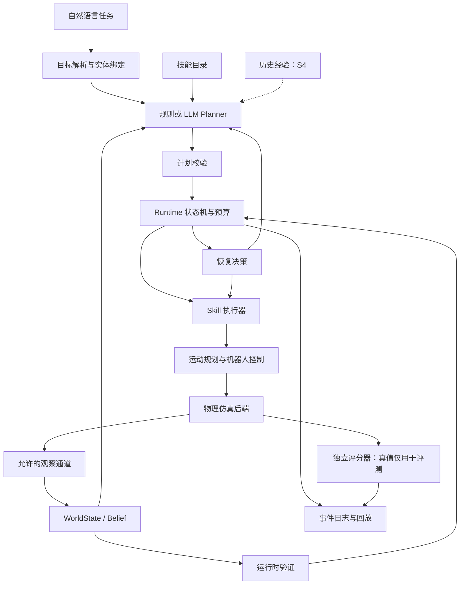

# Embodied Agent Framework：下一阶段实现规格与长期演进边界

版本：v1.0｜日期：2026-09-18｜性质：设计规格，尚未实施或验收

本文是本轮唯一交付物。近期实现范围以 S1 为准；S2～S5 是演进路线，进入对应阶段时再细化。文中的技术选型是结合硬件和目标作出的工程判断，不代表已在本机验证性能。文中所有成功率均为验收目标，不是已有结果。

## 1. 已确认的项目方向

**下一阶段交付：在轻量物理仿真中，固定机械臂通过真实夹爪接触完成 3～5 个物体的整理归位；DeepSeek 输出结构化计划，系统逐步验证，并处理至少一种可复现的物理操作失败。** 用户已确认这一范围。

项目最终应成为一个可演示、可评测、可扩展的单臂操作 Agent Framework：自然语言输入，感知当前场景，组合已有技能，完成多步骤任务，发现失败并恢复，在相似新任务中利用有证据的历史经验。优先级依次为稳定演示、Framework 复用性、长时任务能力。

固定约束：

- 自主设计核心架构、模块与契约，不以 Thea、OpenETA、DAHLIA 等 Agent 项目为改造底座。
- 使用成熟仿真、机器人模型、IK、运动规划和控制组件；不自行开发通用底层求解器。
- 前期使用云端 LLM API，首选 DeepSeek；后续增加云端 VLM，供应商可替换。
- 先接受特权状态；最终 Agent 只能使用 RGB/RGB-D、语言、机器人自身状态及预先声明的标定/配置。
- 不训练 VLA 或大模型；不预设论文创新点，不把 Self-Evolving 设为核心方向。
- 本地硬件为 Windows 11、R7 5800H、16GB RAM、RTX3050 4GB。以单环境、CPU 物理、低分辨率必要渲染为默认。
- 用户近乎全职投入，coding agent 承担主要编码；迭代依据实际运行结果。

## 2. 当前起点：接口原型，尚不是机器人 MVP

已有代码可保留为测试替身，但不能视为机械臂控制已经成功。

| 当前实现 | 已具备的内容 | 尚不能说明的能力 |
|---|---|---|
| `TabletopSimulator` | 二维位置、持有标记、目标占用标记 | 没有机械臂、动力学、接触、轨迹与真实抓取 |
| 规则解析与规划 | 匹配指定 ID，生成 pick/place 顺序 | 不支持一般中文任务理解，不等同 LLM planning |
| 失败注入 | 返回一次预设失败，再尝试 | 不能证明物理失败被检测，不能证明总体成功率提升 |
| Verifier | 检查程序维护的标记 | 与执行器共享状态假设，不能独立判定物理任务成功 |
| MemoryStore | 进程内记录和简单文本匹配 | 记录未持久化；规则 planner 未使用检索结果，不具备经验迁移 |
| DeepSeekAdapter | HTTP 调用入口 | 未接入 Agent 主循环，未验证在线任务规划 |
| 三个测试 | 覆盖小范围程序路径 | 不是 benchmark，也没有统计意义上的成功率证据 |

下一轮还需处理的具体缺陷：解析器先根据同现 ID 猜测映射，可能错误配对；规划器只检查 `placed`，无法纠正放错目标的物体；最终验证失败路径没有消耗重规划预算，可能无限循环；无条件释放持有物不适合物理机械臂；目前只在末尾统一验证，而非每个关键动作后验证。原有“错误目标被验证器拒绝”的测试实际主要触发 place 的类别拒绝，并未证明独立验证器有效。

这些问题纳入 S1 的契约与回归需求，本轮仅记录，不修改程序。早期接口可调整，不应为了保留原型函数签名牺牲正确分层。

## 3. 目标版本与“最终版本”的含义

| 版本 | 主要成果 | 关键限制 |
|---|---|---|
| S0：已有接口原型 | 离线控制流测试替身 | 不称为物理机器人 MVP |
| S1：物理闭环 MVP | PyBullet 单臂、多物整理、DeepSeek、逐步验证、一类恢复 | 使用特权状态，支持范围有限 |
| S2：初版 Agent | 任务组合变化、依赖关系、干扰物、多种恢复与重规划 | 仍以结构化状态为主 |
| S3：视觉 Agent | RGB-D 几何定位、云端 VLM 语义、感知失败处理 | 在声明过的操作技能和场景域内泛化 |
| S4：长程与跨任务经验 | 更长依赖链、技能组合记忆、规划/失败经验检索、消融实验 | 不承诺自主学会任意新动作 |
| S5：可交付 Framework | 插件接口、版本化任务集、回放、指标、文档、稳定演示 | 第二仿真器或机器人是可选扩展验证 |

“完整”是目标范围内的闭环完整，不是无限技能、任意物体或任意任务。自由语言演示应展示新表述和新组合；遇到未知工具、不支持操作或歧义任务，允许明确说明限制或请求澄清。

## 4. S1 任务规格：多物体整理与归位

### 4.1 场景

- 一台固定 Franka Panda 候选机械臂，平行夹爪，一张桌面，一个固定相机视角。
- 起步使用 3 个可稳定夹取的简单刚体：方块、长方体、直立圆柱。不同形状可分两批接入；尖锐不稳定几何不作为第一批门槛。
- 3 个固定目标区域，先用浅托盘或桌面有界放置区，后续再增加高壁收纳盒。
- 目标区域允许容纳多个物体；内部放置点由几何组件根据已占用空间选择。S1 不做堆叠。
- 同一 episode 可整理 3～5 个物体。首次物理连通实验可以只验证一个物体，但对外验收必须是多物体任务。
- 初始物体均在机械臂已测可达域，初始摆放不相交；保留桌边和机械臂基座的安全间距。
- S1 不含抽屉、遮挡识别、精密插装、未知质量估计、工具使用或移动底盘。

### 4.2 自然语言范围

必须支持两类表达：显式物体归位、根据已知属性分类。例：

> 将红色方块放进左边托盘，把蓝色圆柱放到右边托盘，剩下的绿色物体放到中间。

> 把红色物体放入左边托盘，蓝色物体放入右边托盘，其余放到中间。

S1 中“左/中/右”使用预先声明的固定桌面视角；世界坐标和相机坐标不得混用。模型输入含实体 ID、自然语言属性、目标标签和技能目录。属性来自特权状态，文档与演示应明确标注这一点。

歧义处理例：“把那个东西收好”没有唯一目标时返回 `needs_clarification`；不得猜测一个分配关系并把猜测当正确答案。

### 4.3 任务完成条件

由独立任务定义生成目标，不由 Agent 自己生成验收标准。每个目标对象必须处于指定放置区域的有效范围，受桌面/托盘支撑，未被夹爪持有，并在稳定窗口内保持该状态。所有目标同时成立、无硬性约束违反、未超预算、无人为干预，episode 才成功。

S1 的物体与目标位置可公开给 Agent；隐藏的基准答案、故障触发条件和评分器内部状态不能公开给 LLM。

### 4.4 第一种可复现故障

首选“第一次抓取偏移导致未抓到”：故障注入器只在指定第一次 grasp 的接近目标中引入预先冻结的位姿偏移，由物理引擎产生抓空结果。

期望闭环：夹爪闭合 → 提升验证发现物体没有随夹爪抬起 → 返回 `GRASP_MISS` → 安全撤退/张爪 → 重新观察 → 重新计算候选 → 再抓取 → 放置 → 验证成功。

Agent 不能读取“这是一次注入失败”或预知下一次必然成功。故障幅度先在开发集校准，再固定用于验收。纯粹返回 false 的注入继续用于单元测试，不计为物理恢复证据。

## 5. S1 范围和优先级

| 级别 | 必须包含的能力 |
|---|---|
| MUST | 物理机械臂、真实夹爪接触、3～5 个对象、可复现 reset、规则基线、在线 DeepSeek 结构化规划 |
| MUST | 每个 pick/place 后验证、最终独立评分、抓空检测与有界恢复、故障及成本日志 |
| MUST | 计划 schema、实体/技能校验、超时/动作/重规划总预算、稳定失败退出 |
| MUST | 无恢复对照、固定验收集、成功与失败回放、安装和运行说明 |
| SHOULD | 简洁状态显示、目标区域内多物体空位选择、执行中取消、中文任务改述 |
| LATER | VLM、开放物体识别、向量数据库、自动技能生成、多仿真器、ROS2、工具使用 |

episode 原始记录从 S1 开始积累，检索增强在 S4 评估；不能把记录日志称为已经实现了跨任务学习。

## 6. 仿真器、控制组件与运行环境

### 6.1 仿真选型

| 选项 | 本项目定位 | 依据与限制 |
|---|---|---|
| PyBullet | S1 主选，后续尽量沿用 | 官方提供 Python 机器人仿真入口；适合做小场景和显式控制接口。[官方仓库](https://github.com/bulletphysics/bullet3) |
| MuJoCo | PyBullet 不满足关键接触/控制需求时的备选 | 原生 Python bindings 和 viewer 可用；仍需我们集成机械臂控制与任务层，不会自动消除抓取难题。[官方文档](https://mujoco.readthedocs.io/en/latest/python.html) |
| ManiSkill | 后期可选任务环境/评测扩展 | 支持 CPU/GPU 仿真和 Gymnasium 接口；不能仅因 GPU 并行宣传就判断本机性能，须单环境实测。[Quickstart](https://maniskill.readthedocs.io/en/latest/user_guide/getting_started/quickstart.html) |
| RLBench | 借鉴任务组织，后续可选外部评测 | 依赖 CoppeliaSim/PyRep，增加另一套环境；不直接当 PyBullet 任务包。[官方仓库](https://github.com/stepjam/RLBench) |
| LIBERO | 参考组合泛化与迁移划分，S4 后可选子集评测 | 面向知识迁移和机器人学习，需要额外动作/环境适配；不要求复现其训练算法。[官方仓库](https://github.com/Lifelong-Robot-Learning/LIBERO) |

PyBullet 推荐来自当前需求的工程判断，不是“比其他引擎更好”的通用结论。不得同时维护三套后端作为前期里程碑。

### 6.2 底层复用方案

- 用成熟 Panda 机器人描述与 PyBullet URDF 加载能力，记录模型来源、版本和许可。
- 先使用 PyBullet IK 与关节位置/速度控制接口；对候选解检查关节限制、末端误差和碰撞。
- 运动规划优先集成 `pybullet_planning` 的成熟工具，通过自有 `MotionPlanner` 适配器封装。原始 `pybullet-planning` 与可安装的 `pybullet_planning` 分支需区分，固定一个经过验证的版本，不混用 API。[项目说明](https://github.com/caelan/pybullet-planning)、[包文档](https://pybullet-planning.readthedocs.io/en/latest/)
- 空旷场景可先采用经碰撞检查的接近—抬升—转移—下降路径；这是受限场景方案，不声称通用避障。不能把直线关节插值当作任意场景的无碰撞保证。
- 对夹持物加入路径碰撞检查，声明允许的接触对；抓取接触、托盘支撑接触不等于异常碰撞。
- 低层执行在本地高频运行；云端模型只参与技能边界的决策，不进入电机控制循环。

### 6.3 物理真实性边界

正式验收使用物理接触和夹爪约束力完成抓取。禁止在执行途中直接修改物体位姿到目标，禁止把固定约束吸附或瞬移隐藏成成功抓取。仿真 reset 和规划用影子状态可以设置位姿，但不得污染执行世界。

若调试期间使用吸附辅助，必须标记为 `assisted_grasp`，单独出表；不能满足当前用户已确认的真实夹爪 S1 门槛。

### 6.4 环境预检与资源

默认 Windows 原生单环境；Python 版本由目标依赖 wheel 的兼容性决定，建立项目独立环境并锁定依赖，不能绑定 coding agent 内置 runtime 路径。预检限约一个工作日：安装、机械臂加载、1000 步动力学、一次 IK、碰撞查询、RGB/深度截图、GUI/headless 各一次。

若本机平台对必要规划依赖造成持续阻碍，转 WSL2/Ubuntu 做同样预检；只有物理功能或维护成本确有证据不合适时再切 MuJoCo。切换需记录理由，不因一个抓取失败立即更换引擎。

初始参数建议：物理步长 1/240 秒，GUI 可限帧；相机 640×480，按技能前后采集，批量评测默认不实时显示。参数属于起始配置，按实测锁定。监测进程峰值内存、显存、每 episode 耗时，禁止未测先承诺固定 FPS。

## 7. 架构：职责分离，但保持小型实现

采用一个显式状态机 Runtime，不引入多 Agent 协商、复杂消息总线或通用工作流平台。逻辑模块可以先放在少量文件中。



关键区别：Simulator 负责物理步进、传感器和机器人动作接口；Skill 负责多步操作与控制器调用；它们不能都实现一套语义 `pick/place`。Agent 仅依赖 Skill 与观察契约，不直接访问仿真 API。

| 模块 | 输入 → 输出 | 不应承担的职责 |
|---|---|---|
| Task Interpreter | 语言、场景实体 → GoalSpec | 不生成隐藏评分真值 |
| Planner | GoalSpec、当前状态、技能目录 → Plan | 不控制关节，不修改世界 |
| PlanValidator | Plan、技能 schema、状态 → 合法/拒绝 | 不证明未来所有动作必然成功 |
| Runtime | 合法计划、事件、预算 → 调度与终态 | 不写求解 IK 的算法 |
| SkillExecutor | SkillCall、机器人/观察接口 → SkillResult | 不把程序未报错当任务成功 |
| Perception | 允许的传感器输入 → 带来源的 WorldState | 不越权读取隐藏物体 ID/位姿 |
| RuntimeVerifier | 目标、执行后观察 → satisfied/unsatisfied/unknown | 不相信模型自述成功 |
| RecoveryPolicy | 失败证据、当前状态、预算 → 恢复动作或重规划 | 不一律开夹爪、reset 世界 |
| EpisodeStore | 事件 → 持久化记录 | S1 不承担学习/自动改策略 |
| Evaluator | 基准目标、仿真真值、事件 → 分数 | 真值不回流到视觉 Agent 决策 |

## 8. 核心数据契约

以下是设计级字段，实施时通过 dataclass/Pydantic 等成熟库落实。统一 SI 单位：米、弧度、秒；位姿明确 `frame_id`，四元数统一为 `xyzw`，不能依赖调用方猜测。

### 8.1 Observation 与 WorldState

`Observation`：`episode_id`、`observation_id`、`sim_time`、`wall_time`、`source`、机器人关节/夹爪状态、相机内外参及帧引用、允许的测量。S1 的 `source=privileged` 包含物体真值，视觉模式则仅保留允许的传感器内容。

`WorldState`：`state_version`、实体列表、目标区域、空间关系、持有状态、观测时间、可见性、置信度、证据引用。物体用稳定逻辑 ID，仿真 body ID 由 adapter 私有维护。`held_object` 支持 unknown，不能强行二值化。VLM 自报置信度需视作未标定分数，不能当真实概率。

相机姿态来自已知标定或机器人正运动学，属于允许的配置；场景实例的隐藏位姿、实例分割真值和目标完成标签不属于最终视觉输入。

### 8.2 TaskInput / GoalSpec / EvalSpec

- `TaskInput`：用户原话、任务 ID、语言与声明过的约束。
- `GoalSpec`：Agent 解析的实体—目标关系、完成谓词、禁止条件、歧义状态。
- `EvalSpec`：任务集作者/生成器独立创建的期望关系、评分容差、稳定时间、允许接触、预算；不经过模型重写。

例如：模型把“红色放左边”理解成右边，即使按自己的计划执行成功，也必须在独立 Evaluator 中判失败。

### 8.3 Plan

```json
{
  "schema_version": "1",
  "plan_id": "p2",
  "based_on_state_version": 12,
  "goal_ref": "g1",
  "steps": [
    {"id": "s1", "skill": "pick", "args": {"object_id": "obj_red_1"}},
    {"id": "s2", "skill": "place", "args": {"object_id": "obj_red_1", "target_id": "tray_left"}}
  ]
}
```

S1 用有序列表，不提前设计复杂规划语言。SkillRegistry 规定动作前置/后置条件；模型可以建议额外约束，但不能删除强制条件。计划校验区分：语法合法、引用合法、符号序列可行、当前动作可执行、几何路径可行。不能要求所有未来步骤的前置条件在初始状态就满足。

计划可一次返回完整列表，Runtime 仍逐步执行和验证；遇到状态偏差，重新生成剩余计划。已完成任务是否保留由当前谓词决定，不使用永久 `placed=True` 标记。

### 8.4 SkillCall / SkillResult

`SkillCall` 包括唯一调用 ID、参数、关联 plan/step、timeout、预期状态版本。唯一 ID 用于追踪和去重，不意味着物理动作天然幂等；未知执行结果必须先观察再决定是否重试。

`SkillResult` 至少包含：`status`（completed/failed/timeout/uncertain/cancelled）、`failure_code`、开始/结束时间、执行前后观察引用、已执行阶段、持有状态、相关测量和剩余动作建议。

“控制命令发出”“技能执行完成”“目标谓词成立”“episode 判分成功”是不同事件，不能共用一个 success 标志掩盖区别。

### 8.5 VerificationReport / EpisodeResult

`VerificationReport`：每条谓词的 true/false/unknown、证据、观察来源、容差版本及冲突条件。缺少证据时应 unknown，不得自动通过；空目标不以 `all([])` 判成功，合法的 no-op 任务需显式定义。

`EpisodeResult`：终态、独立任务分数、对象完成数、失败类型、恢复/重规划计数、模型调用与成本、仿真/真实耗时、是否 fallback、是否人工干预、配置与产物引用。

## 9. 技能库与低层控制

S1 暴露给 LLM 的技能尽量少，低层控制阶段在技能内部完成。

| 技能 | 前置条件 | 内部执行 | 必须验证的效果 |
|---|---|---|---|
| observe | 机器人处于可观察状态 | 读取允许通道，更新 WorldState | 新观察有效且具有时间/来源 |
| pick(object_id) | 对象可定位，夹爪空闲，候选可达 | 接近、张爪、下降、闭合、抬升 | 物体被抬起且稳定随末端移动 |
| place(object_id, target_id) | 确认持有，目标存在有效空位 | 转移、下降、释放、撤退、等待稳定 | 物体在目标范围，未被持有 |
| safe_retreat | 当前姿态与持有状态已知或可保守处理 | 沿可行路径撤退，必要时到安全放置位 | 未引入新碰撞且进入可恢复状态 |

`reach/open_gripper/lift/move/close_gripper` 是控制内部 primitive，S1 不要求 LLM 逐项生成。`verify` 由 Runtime 在技能后强制触发，不依赖 LLM 记得调用。

不实现泛化的“释放所有东西”恢复接口。如果仍持有物体，应继续放置或放到声明的安全临时区；未知持有状态时先停稳观察，不能无条件松手。

## 10. LLM 规划与模型适配

### 10.1 DeepSeek 的角色

S1 可用一次结构化请求返回 GoalSpec 与 Plan，逻辑上保留解析/规划两个接口以便单独测量。模型负责语言理解、实体绑定、动作排序与必要的剩余任务重规划；确定性组件负责坐标计算、IK、轨迹、碰撞和完成判定。

模型名、endpoint、认证、温度、最大输出、timeout 通过配置注入。正式接入时核对账户可用模型与对应能力，不能把已有 `deepseek-chat` 占位当作长期固定契约，也不预设该型号具备视觉能力。

DeepSeek 官方有 JSON 输出文档入口；本次能检索到入口，但页面正文抓取未成功，因此具体模型、JSON/function calling 支持细节列为实施前验证项。无论 provider 是否提供 strict schema，客户端仍须做结构和语义校验。[DeepSeek JSON 输出文档](https://api-docs.deepseek.com/guides/json_mode/)

### 10.2 调用控制

- 初始完整计划一次调用；正常执行步骤无需再次调用 LLM。
- 常见抓空由确定性 RecoveryPolicy 先处理，只有目标/顺序需要改变才调用 replan。
- JSON 解析失败最多一次修正；网络超时/临时限流最多两次退避重试；认证或配置错误直接报告。
- 只传必要状态摘要、技能 schema、当前未完成目标和相关失败证据，避免无界历史上下文。
- 不记录或索取模型隐藏推理；记录结构化输出、简短决策理由和执行证据即可。
- fixture/mock 模式仅用于离线测试；在线验收必须真实调用并记录 provider/model。

### 10.3 API 不可用时

调试可以显式切换为 rule/fixture 模式。在线 LLM 验收不得静默切规则 planner 后计作 LLM 成功。已获得验证过的计划可按配置完成现有任务，若新决策确实依赖 API 则受控退出。

规则 baseline 从 benchmark 的结构化任务目标生成计划，不伪装成通用中文解析器；这代表“给定正确目标”的控制/执行对照。端到端 LLM 指标需包含语言解析错误。

### 10.4 初始预算建议

每物体最多 2 次额外操作尝试；每 episode 最多 3 次全局 replan、30 次物理技能调用、10 次模型请求（含重试）、15 分钟真实时间；单技能 30 秒仿真时间超时。所有计数器与墙钟上限覆盖 verification-failed 分支，避免无限循环。连续 3 次无新进展触发终止。

这些是初始可配置上限，不是性能承诺；验收前在 dev 集锁定。人民币预算尚未给定，因此不伪造费用目标：先运行小规模调用测量 token/延迟，再用当时实际单价估算批量费用，配置每次实验花费上限。

## 11. Verification、Recovery 与 Replanning

### 11.1 运行时验证与评测隔离

S1 的运行时验证允许读物理真值，但应从仿真实际几何/速度/接触计算，不能读取 skill 写下的 `placed/held=True` 作为证据。Evaluator 使用独立 EvalSpec，即使底层都来自同一个物理引擎，也不得读取 Agent 的判断作为答案。

S3 后运行时验证只使用允许的视觉/机器人输入；Evaluator 仍可读取真值评分，且保持不可回流的通道。Oracle 与视觉的差距是实验结果，不应通过在技能内偷读真值消除。

### 11.2 判定规则

初始几何容差建议在开发集验证后冻结：放置 footprint 位于目标有效多边形内并留 5mm 边距；支撑高度误差不超过 1cm；速度低于 0.02m/s、角速度低于 0.2rad/s，持续 0.5 秒仿真时间；夹爪不再承载该物体。数值必须与物体尺寸和任务匹配，不能为了让测试通过在 test 集调参。

抓取成功联合检查抬升高度（如高于原支撑面 3cm）、与夹爪的相对运动稳定性和接触/夹爪状态；只检测到接触并不等于已抓住。最终放置验证应在撤退后再次进行，避免把夹爪暂时托住当归位成功。

### 11.3 失败处理矩阵

| 失败 | S1 行为 | S2+ 扩展 |
|---|---|---|
| GRASP_MISS | 重新观察、撤退、更新抓取候选、有界重试 | 多抓取方向与失败经验 |
| IK/路径不可达 | 当前步停止，记录诊断，预算内改候选或失败退出 | 换操作顺序、移动挡路物 |
| 未确认物体释放/掉落 | 标记状态未知，观察后继续放置或失败退出 | 有限范围重新抓取 |
| 目标无空位 | 禁止盲目 place，报告不可执行 | 临时区搬运、重排目标顺序 |
| INVALID_PLAN | 不执行，有限格式/语义修正 | 依赖图与更复杂约束检查 |
| VERIFY_FAILED | 重新观察，保留真实已完成项，消耗预算 | 局部或全局 replanning |
| 超时/异常碰撞 | 本地停稳、记录、受控退出 | 更丰富诊断恢复 |

S1 只要求抓空一种故障能自主恢复；其余类型至少被正确报告并有界终止，不声称都能恢复。

重试是同一目标下重新执行；恢复是让局部状态重新可执行；重规划是改变剩余动作序列或子目标。三者单独记录，不能把重复原计划算作策略级改进。

## 12. 评测设计：先定义分母，再谈成功率

### 12.1 自建任务集

S1 建立自有 `TabletopOrganize-v1` 小型工程评测集：任务自然语言、独立 Goal/EvalSpec、初始场景、seed、故障配置、预算和版本全部可保存。不称为公共标准 benchmark。

| 集合 | 用途 | 推荐规模与规则 |
|---|---|---|
| smoke | 每次改动快速检查 | 5 个可读案例：正常、3/5 物体、一次抓空、非法目标 |
| dev | 控制/提示词/容差调试 | 20 个配置，可反复调试 |
| S1-clean | 固定任务域正式验收 | 3/4/5 物体各 10 个预固定配置 × 3 次独立运行 = 90 episodes |
| S1-fault | 恢复配对实验 | 30 个固定故障配置 × 3 次运行，两组分别启用/禁用 recovery |
| negative | 边界行为 | 至少 10 类不存在实体、歧义目标、空目标、预算耗尽等案例 |

固定任务域允许在小范围内扰动初始位置和改变指令表述；物体类别、目标规则和可达范围保持定义内。种子固定并不保证不同机器或云端模型逐比特确定，须记录版本和重复波动。

### 12.2 S1 验收门槛

| 编号 | 验收条件 |
|---|---|
| A1 | 规则规划 + 物理执行在 S1-clean 达到 ≥80% 完整任务成功率，用于定位控制能力 |
| A2 | 在线 DeepSeek 端到端在同一域达到 ≥80%；无人工帮助、无隐式规则 fallback、真实物理夹取 |
| A3 | S1-fault 的 recovery 组相对 no-recovery 组存在可重复正向增益；初步目标 ≥20 个百分点，且配对差异的 95% 区间下界 >0 |
| A4 | 所有 negative 用例在预算内终止/澄清，非法动作不执行；没有已知假成功样例 |
| A5 | 提供一次完整多物体在线演示、一次物理恢复回放、一次真实失败回放，以及对应逐事件证据 |
| A6 | 新环境可按文档完成安装、smoke 与指定 episode 复现，产物包含依赖与配置快照 |

A3 是拟定的工程验收要求，不是对未来效果的承诺。若样本不足或收益不稳定，应补实验、分析失败分布；不能只摘选演示替代结论。

### 12.3 指标和统计

主指标：完整任务成功率 = 所有约束满足且无人工干预的 episodes / 所有有效正式试验。报告成功数/总数、95% Wilson 区间、各物体数量分层、3 次运行范围。总体达到 80% 但区间很宽时，只称“该样本上的点估计达标”，不称总体保证。

配对故障实验固定任务、初始状态、扰动策略、模型配置和初始计划（可重放同一计划以隔离 recovery）；改变的只有 recovery 开关。区间按场景/任务配置聚类 bootstrap，避免把同一配置的重复运行当完全独立样本。另报告完整在线任务的结果，以反映真实 API 波动。

次指标：每对象成功率、首次抓取成功率、计划有效率、目标解析正确率、未完成目标数、检测延迟、恢复成功数/失败事件数、重试/replan 次数、动作增量、墙钟/仿真时间、API 请求/token/费用、人工干预率。

API 超时/限流在端到端可靠性指标中计失败；物理仿真崩溃单列并纳入可靠性统计。场景生成器产生的非法初始状态属于基础设施缺陷，要记录数量，按事先定义的校验规则补齐有效测试；不能事后把困难任务改称无效样本。

### 12.4 防止自证成功与数据泄漏

- Evaluator 测试必须覆盖：放错目标但标记成功、物体暂时经过目标、仍被夹持、放好后被撞离、目标解析错误。
- test 配置在报告前冻结；针对 test 修改控制/提示词后应换新一轮测试或明确标记调试污染。
- S4 的 memory 只能来自开发/历史支持任务，不能提前写入目标测试题答案；固定检索库后评估未见组合。
- 总成功率高不代表每个新模块有效。LLM 相对规则基线首先检验语言适应与组合灵活性，不要求它在简单固定排序上战胜 oracle 规则。

## 13. 下一轮实施工作包与顺序

以下为进入编码后执行的计划，不是本轮已经完成的工作。

| 工作包 | 实施内容 | 可评审产物与验收 | 依赖 |
|---|---|---|---|
| W0：运行预检 | Python/仿真/机器人/规划组件兼容性 | 环境清单、截图、物理步进与 IK/碰撞结果 | 无 |
| W1：物理操作基线 | Panda、桌面、托盘、3 物体、成熟控制组件 | 手写目标序列下真实夹取归位的轨迹、视频、失败样例 | W0 |
| W2：契约与有界 Runtime | 状态来源、Plan/Goal 分离、逐步验证、预算、原型缺陷修正 | schema、状态转换和失败回归测试 | W1 暴露的真实接口需求 |
| W3：评测与日志 | task spec、独立判分、seed、JSONL、CSV、回放 | rule baseline 报告，不足 80% 时先修控制/判分 | W1、W2 |
| W4：DeepSeek 闭环 | adapter、结构化目标/计划、参数验证、有限修正 | 在线自然语言多物体 episode；解析/执行分项指标 | W2、W3 |
| W5：物理失败恢复 | 抓取偏移、检测、重新观察、有界恢复/replan | 同配置 recovery/no-recovery 对比报告 | W3、W4 |
| W6：S1 发布验收 | 固定测试集、独立重复、README、演示整理 | A1～A6 证据包，明确未达标项 | W0～W5 |

不要先花数天全面重构二维 prototype。先用 W1 发现物理操作需要什么，再完成 W2 的最小契约调整；同时避免把 W1 临时代码继续堆成最终 Runtime。

排期只是启动估算：W0～W1 约 2～4 个工作日，W2～W3 约 3～5 日，W4 约 2～3 日，W5～W6 约 3～6 日，总计约 10～18 个全职工作日，并为抓取/平台兼容预留约 30% 缓冲。AI 编码可压缩样板实现，但接触调试和重复试验仍需时间；完成 W1 后必须按实际运行情况重新估算。

若进度受阻，先减少物体几何种类、缩小扰动范围、使用浅放置区；保留多物体、真实夹取、在线 LLM、验证和故障恢复这五个核心。不能用隐藏吸附或瞬移换取“按时成功”。

## 14. 工程交付与复现要求

S1 实施时应形成下列内容：

- 最小 install/run/evaluate/replay 入口，具体 CLI 名称可由实现决定。
- 版本化场景与任务配置、技能目录、固定种子列表、依赖锁定文件。
- 每次运行目录包含 `config.json`、`events.jsonl`、`summary.json`、模型请求元数据、必要帧/视频、错误诊断。
- 事件串联 episode/plan/skill/observation ID，记录失败前后状态；视频仅保留精选/失败案例，避免所有 RGB-D 帧无界增长。
- 模型响应重放与轨迹重放分开：前者隔离规划变化，后者展示已有执行；都不冒充重新在线完成任务。
- README 标注支持范围、特权状态模式、物理抓取模式、成功率分母、失败案例、已知限制和成本。

建议初期仅有 `core`、`adapters`、`skills`、`evaluation` 四个逻辑包；感知、Memory、任务插件在功能进入时再扩展。选用 Python 类型检查、pytest、JSONL/CSV 与必要的 schema 库即可，暂不引入数据库服务或监控平台。

## 15. 后续阶段：以主线任务逐渐加深

| 阶段 | 任务与能力 | simulator / benchmark | 验收重点 |
|---|---|---|---|
| S2 初版 | 3～6 个对象、同类多物、干扰物、先后顺序、移动挡路物、局部与全局 replan | 继续 PyBullet，自有 TabletopOrganize-v2；参考 Ravens/CLIPort 的任务划分 | 变化组合目标 ≥70%；按故障类型证明恢复覆盖，无状态丢失 |
| S3 视觉 | 固定 RGB-D → 图像候选/几何反投影 → 云端 VLM 语义绑定 → 跨帧实体跟踪 | 同场景的 oracle/sensor 两种通道；不同时更换引擎 | 三个通路分别报告：oracle、含分割真值的过渡模式、纯传感器；最终纯传感器组合任务目标 ≥70% |
| S4 长程/记忆 | 5～10 物体，多子目标与依赖，暂存区；经验检索和技能组合；工具使用独立扩展 | TabletopOrganize-v3；资源允许时选 LIBERO 或 RLBench 的少量适配任务 | 未见组合目标 70%～80%；memory/recovery 消融稳定改善；未达到就定位瓶颈 |
| S5 Framework | Task/Skill 插件、文档、错误诊断、可视化回放、能力边界说明 | 保留自建版本化任务集；可选接一个外部环境 | 新任务无需改 Runtime；外部读者可复现；演示和报告一致 |

S3 的过渡分割真值只用于调通图像到几何链路，不得纳入“最终视觉输入”成绩。最终 low-level grasp 候选也必须来自观测估计，不能只有 Planner 看图、控制器继续偷用物体真值。

云端 VLM 提供语义、图像区域或候选关系；3D 定位用深度、标定和确定性几何完成，不依赖模型凭图编造精确米制坐标。优先使用简单几何/颜色分割或云端视觉能力；若需要本地预训练检测器，先评估 4GB 显存，并且不默认开启训练。

“长程”除了步骤数，还必须增加先后依赖、中间状态和部分失败后的持续执行。搬十个互不相关物体主要测试重复可靠性，不能单凭十次搬运声称复杂长程推理。

工具使用在抓取/放置和视觉闭环稳定后选择一个有明确测量的实例，例如持拨杆将目标推到指定区域；单独增加接触技能及谓词。刀具、复杂装配、柔性物体和自由工具发明都延期。

## 16. Memory：从记录到可证明有用的经验

S1 只做 episode 持久化，S2 建立失败分类；S4 再加入经验检索，按用户优先级依次尝试：

1. **技能组合**：已验证的参数化组合，例如先清空临时区再整理目标区域。保存适用条件、步骤模板和版本，不保存可任意执行的模型生成代码。
2. **规划经验**：针对目标占用、顺序约束等问题的经过验证的策略；当前场景不适用时忽略。
3. **失败与恢复经验**：症状、当时状态、恢复动作、是否成功、证据链接和适用范围。

先用结构化标签过滤 + 文本相似度，检索少量候选；只有数据量和质量证明需要时才加 embedding/vector DB。物体与场景知识、动作参数仍作为底层记录，不先做复杂知识图谱。

新增经验必须关联评测/验证证据，并保留失败案例；实体 ID 和绝对坐标不能直接跨场景重用。技能变更后旧经验按版本失效或重新验证。自动生成的新技能组合进入候选区，测试通过才加入正式库。

评估采用 2×2：无 Memory/有 Memory × 无 Recovery/有 Recovery，其他组件、任务和预算相同。检索库来自支持集，冻结后测试未见组合；增加等长度无关检索作为诊断，排查只是额外 token 导致的差异。若成功率无稳定提升，仅延迟/调用减少，则如实报告效率收益，不宣称任务能力提升。

## 17. 论文与开源参考：每项对应一个设计问题

以下资料用于设计参考，不复刻整个系统；经典工作用于明确方法边界，不声称是最新 SOTA。来源核查日期为 2026-09-18。

| 资料 | 关注点 | 本项目采用方式 / 暂不采用 |
|---|---|---|
| [SayCan，2022](https://say-can.github.io/) | 语言目标与机器人技能可行性的结合 | 借鉴技能 grounding；S1 用确定性前置条件/几何检查，不训练原方法的价值函数，也不称为完整 SayCan 复现 |
| [Inner Monologue，2022](https://innermonologue.github.io/) | 把成功检测和环境反馈带回语言规划 | 借鉴观察—动作—反馈—修正闭环，反馈来自证据而非模型自我宣布 |
| [Code as Policies，2022](https://code-as-policies.github.io/) | 语言驱动组合控制 API | 借鉴模块化 API 与组合；当前用 typed Plan，暂不执行任意生成程序 |
| [Ravens / Transporter Networks，2020](https://github.com/google-research/ravens) | 桌面操作任务、视觉操控评测 | 参考任务生成和目标判定组织；不训练 Transporter policy，不将其动作抽象直接等同 Panda 真实夹爪 |
| [CLIPort，2021](https://github.com/cliport/cliport) | 语言语义与空间操作的分工，任务变化 | 借鉴属性/组合划分；不把其整套学习依赖引入 4GB 本地 MVP |
| [VoxPoser，2023](https://voxposer.github.io/) | 语言/视觉语义到空间表示与规划 | S3 学习 grounding 分层；初期不实现完整 3D value map、代码生成和 MPC 系统 |
| [Voyager，2023](https://arxiv.org/abs/2305.16291) | 可检索技能库、反馈与经验复用 | S4 借鉴经验组织；其环境是 Minecraft，不是机械臂验证证据，不把自动课程/Self-Evolving 设为主线 |
| [LIBERO，2023](https://github.com/Lifelong-Robot-Learning/LIBERO) | 对象、空间、目标等迁移划分 | 参考测试集设计；迁移自定义动作/技能后单独报告协议，不能直接与其学习 policy 分数混比 |
| [RLBench](https://github.com/stepjam/RLBench) | 多任务组织、变化、成功条件 | S2 后参考任务插件；选择外部任务须适配原引擎、机器人和动作接口 |
| [PyBullet Planning](https://github.com/caelan/pybullet-planning) | 成熟的运动/操作规划工具 | 用组件适配方式复用，核对分支、平台支持和版本；不因此采用他人的 Agent 架构 |

实施前最小阅读顺序：PyBullet 控制/接触文档和规划组件 → SayCan、Inner Monologue 的框架与失败分析 → Ravens/CLIPort 的任务与判定 → S3 读 VoxPoser → S4 再读 Voyager/LIBERO。每次阅读产出一个“采用什么、对应接口、如何验证”的短设计记录，避免文献阅读替代可运行进展。

## 18. Framework 与岗位能力的对应证据

尚未提供具体岗位 JD，因此以下是能力维度映射，不声称符合某个特定公司的全部要求。

| 能力维度 | 应能展示的项目证据 |
|---|---|
| LLM/VLM Planning | 自然语言目标解析、实体 grounding、结构化计划、模型替换和无效输出处理 |
| Robotics / Control 集成 | 坐标变换、IK/路径规划组件、真实夹爪接触、碰撞诊断 |
| Agent Architecture | 有界 Runtime、技能契约、状态版本、可审计的 recovery/replan |
| Evaluation | 独立判分、成功率分母、置信区间、固定任务集、消融和失败分类 |
| Perception | RGB-D 到几何、视觉语义绑定、不确定性与无特权信息泄漏 |
| Long-horizon / Memory | 中间目标依赖、断点继续、跨任务检索、正/负迁移验证 |
| 工程质量 | 可复现配置、测试、回放、日志、成本、文档与扩展任务示例 |

丰富技术栈应由这些实际问题驱动；不是把 ROS2、Docker、多数据库和多 Agent 全部装进仓库才算高质量。

## 19. 暂缓项、变更触发条件与完成定义

| 暂缓内容 | 何时重新考虑 |
|---|---|
| 第二仿真器 | 第一任务域稳定，且有外部 benchmark/后端可移植性需求 |
| ROS2 / MoveIt | 现有成熟规划组件不足、真实机器人/多进程通信需要；不重复造已有能力 |
| Docker / CI 图形环境 | 可复现依赖已明确，再固化环境；先 headless 回归 |
| 向量数据库/知识图谱 | 结构化检索出现可测量召回瓶颈 |
| 自动技能生成/自我改进 | 已有验证、隔离测试和技能版本治理；系统问题证明值得做 |
| 大模型/VLA 训练 | 推理 API + 成熟控制路线无法满足已证实需求，且有数据与预算 |
| 重型仿真与高保真资产 | 当前视觉/物理简化成为主要误差源且资源允许 |
| 移动机械臂/双臂 | 固定单臂完整框架已交付，再设新的任务与接口范围 |

待实测事项：PyBullet/Python/规划库在本机的可用组合、物理抓取可靠性、DeepSeek 当前模型与结构化输出能力、实际 API 开销。它们不阻塞规格成文，但必须在对应工作包中验证，不能隐式当作事实。

S1 完成以 A1～A6 的证据为准。完整 Framework 完成还需：纯传感器模式下完成声明范围的任务；至少三类具有不同约束的任务族；恢复/记忆的收益有对照数据；新增任务不改 Runtime；使用者可独立复现。若记忆尚无可靠收益，应标注“经验模块实验中”，不能为了版本名称提前宣称跨任务改进。

本项目最先应获得的成果，是一次可解释、可重跑、有失败证据的真实物理多物体整理闭环。研究创新点在该系统的错误分布与实验结果出现后再确定。
